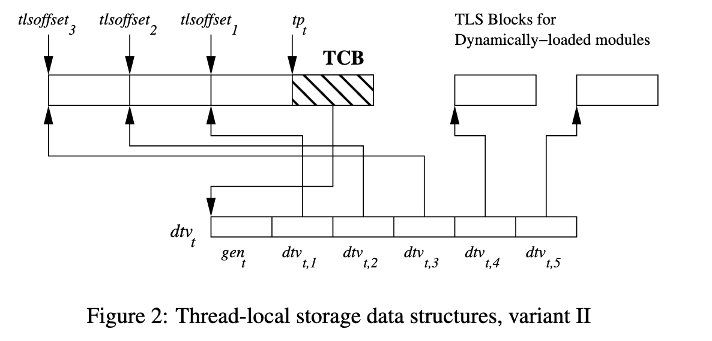

# glibc 2.31 的 TLS 实现探究

## 背景

TLS 是 thread local storage 的缩写，可以很方便地存储一些 per-thread 的数据，但它内部是怎么实现的呢？本文对 glibc 2.31 版本的 TLS 实现进行探究。

<!-- more -->

## __thread

首先来看 TLS 在 C 中是怎么使用的：用 `__thread` 标记一个全局变量，那么它就会保存在 TLS 当中，每个线程都有一份：

```c
__thread int data;
```

那么编译器在生成访问这个 TLS 全局变量时，生成的指令也不同。以下面的代码为例：

```c
int global_data;
__thread int tls_data;

void global(int val) { global_data = val; }
void tls(int val) { tls_data = val; }
```

生成的 amd64 汇编如下：

```asm
        .text
global:
        movl    %edi, global_data(%rip)
        ret

tls:
        movl    %edi, %fs:tls_data@tpoff
        ret

        .section        .tbss,"awT",@nobits
tls_data:
        .zero   4

        .bss
global_data:
        .zero   4
```

访问全局变量的时候，采用的是典型的 PC-relative 方式来找到全局变量 `global_data` 的地址；访问 thread local 变量的时候，可以看到它采用了一个比较少见的写法：`%fs:tls_data@tpoff`，它的意思是由链接器计算出 `tls_data` 相对 `%fs` 段寄存器的偏移，然后直接写到指令的偏移里。链接以上程序，可以看到最终的二进制是：

```asm
0000000000001140 <global>:
    1140:       89 3d ce 2e 00 00       mov    %edi,0x2ece(%rip)        # 4014 <global_data>
    1146:       c3                      ret
    1147:       66 0f 1f 84 00 00 00    nopw   0x0(%rax,%rax,1)
    114e:       00 00

0000000000001150 <tls>:
    1150:       64 89 3c 25 fc ff ff    mov    %edi,%fs:0xfffffffffffffffc
    1157:       ff
    1158:       c3                      ret
```

可见最终 `global_data` 被放到了相对二进制开头 `0x4014` 的地方，而 `tls_data` 被放到了 `%fs:-0x4` 的位置。那么这个 `%fs` 是怎么得到的，`-0x4` 的偏移又是怎么计算的呢？下面来进一步研究背后的实现。

## TLS 的组织方式

首先 TLS 是 per-thread 的存储，意味着每个新线程，都有一个 buffer 需要保存 TLS 的数据。那么这个数据所在的位置，也需要一些 per-thread 的高效方式来访问，在 amd64 上，它是通过 `%fs` 段寄存器来维护的。那么 TLS 可能有哪些来源呢？首先可执行程序自己可能会用一些，它通过 DT_NEEDED 由动态链接器在启动时加载的动态库也有一些（比如 [glibc 的 tcache](./glibc-allocator.md)），此外运行时 dlopen 了一些动态库也会有 TLS 的需求。为了满足这些需求，需要设计一个 TLS 的结构，既能满足这些在启动时已知的可执行程序和动态库的需求，又能满足运行时动态加载的新动态库的需求。

这里面可执行程序和启动时加载的动态库的需求是明确的，不会变的，因此可以由动态链接器在加载的时候，直接给可执行程序和动态库分配 TLS 空间：

1. 比如可执行程序本身需要 0x10 字节的 TLS 空间，它启动时加载两个动态库 libc.so.6 和 libstdc++.so.6,期中 libc.so.6 需要 0x20 字节的 TLS 空间，libstdc++.so.6 需要 0x30 字节的 TLS 空间
2. 加起来一共需要 0x60 字节的 TLS 空间，那么在创建线程的时候，创建好 0x60 字节的 TLS 空间，按照顺序进行分配：
    1. 0x00-0x10: 属于可执行程序
    2. 0x10-0x30: 属于 libc.so.6
    3. 0x30-0x60: 属于 libstdc++.so.6
3. 分配好这个空间以后，因为 libc.so.6 无法提前预知它会被分配到哪个位置，所以需要一次重定位，把 libc.so.6 里的 TLS 空间的使用重定位到分配后的位置，例如 libc.so.6 的 0x20 的 TLS 空间内的开头 8 字节，现在在整个 TLS 空间内的偏移就是 `0x20 + 8 = 0x28`

但是 dlopen 动态加载进来的动态库怎么办呢？这些动态库的数量可以动态变化，可以加载也可以卸载，再这么线性分配就不合适了，这时候就需要给每个 dlopen 得到的动态库分配独立的 TLS 空间。既然是动态分配的空间，那么这些独立的 TLS 空间的地址，不同线程不同，不能通过一个基地址加固定偏移的方式来计算，就需要提供一个机制来找到各个动态库的 TLS 空间的地址。

glibc 的实现中，它把各个动态库的 TLS 空间的起始地址记录在一个 `dtv` 数组中，并且提供一个 `__tls_get_addr` 函数来查询动态库的 TLS 空间内指定 offset 的实际地址：

```c
typedef struct dl_tls_index
{
  uint64_t ti_module;
  uint64_t ti_offset;
} tls_index;

void *
__tls_get_addr (tls_index *ti)
{
  dtv_t *dtv = THREAD_DTV ();

  /* omitted */

  void *p = dtv[ti->ti_module].pointer.val;

  /* omitted */

  return (char *) p + ti->ti_offset;
}
```

其中 `dtv` 数组的指针保存在 `struct pthread`（即 Thread Control Block (TCB)）中，而这个 `struct pthread` 就保存在 `%fs` 段寄存器指向的地址上：

```c
struct pthread
{
  tcbhead_t header;
  /* omitted */
};

typedef struct
{
  /* omitted */
  dtv_t *dtv;
  /* omitted */
  uintptr_t stack_guard;
  /* omitted */
} tcbhead_t;

# define THREAD_DTV() \
  ({ struct pthread *__pd;						      \
     THREAD_GETMEM (__pd, header.dtv); })
```

P.S. stack protector 所使用的 canary 的值就保存在 `pthread.header.stack_guard` 字段中，也就是在 `%fs:40` 位置。

而之前提到的可执行程序本身的 TLS 空间以及程序启动时加载的动态库的 TLS 空间，实际上是保存在 `struct thread` 也就是 TCB 前面的部分，从高地址往低地址分配（图片来源：[ELF Handling For Thread-Local Storage](https://www.akkadia.org/drepper/tls.pdf)）：



图中 $tp_t$ 在 amd64 下就是 `%fs` 段寄存器，它直接指向的就是 `struct thread` 也就是 TCB；从 `%fs` 开始往低地址，先分配可执行程序本身的 TLS 空间（图中 $tlsoffset_1$ 到 $tp_t$ 的范围），后分配程序启动时加载的动态库的 TLS 空间（图中 $tlsoffset_1$ 到 $tlsoffset_2$ 以及 $tlsoffset_3$ 到 $tlsoffset_2$ 的范围）。注意这些偏移对于每个线程都是相同的，只是不同线程的 `%fs` 寄存器不同。

而对于 dlopen 动态加载的动态库，则 TLS 空间需要动态分配，然后通过 `dtv` 数组来索引（图中 $dtv_{t,4}$ 和 $dtv_{t,5}$），因此无法通过重定位修正，而是要在运行时通过 `__tls_get_addr` 函数获取地址。为了让 `__tls_get_addr` 更具有通用性，`dtv` 数组也记录了分配在 `%fs` 指向的 TCB 更低地址的可执行程序和程序启动时加载的动态库的 TLS 空间，此时 `__tls_get_addr` 可以查到所有 TLS 变量的地址。

知道了 TLS 的组织方式后，接下来观察编译器、链接器和动态链接器是如何配合着让代码可以找到正确的 TLS 变量的地址。

## 可执行程序

首先来看一个简单的场景：可执行程序直接访问自己定义的 TLS 变量。前面提到，可执行程序的 TLS 空间直接保存到 `%fs` 往下的地址，因此可执行程序的 TLS 变量相对 `%fs` 的偏移，是可以提前计算得到的。下面看一个例子：

```c
__thread int tls_data1;
__thread int tls_data2;

int read_tls_data1() { return tls_data1; }
int read_tls_data2() { return tls_data2; }
int main() {}
```

编译得到的汇编：

```s
read_tls_data1:
        movl    %fs:tls_data1@tpoff, %eax
        ret

read_tls_data2:
        movl    %fs:tls_data2@tpoff, %eax
        ret
```

这就是在本文一开头就看到的语法：`%fs:symbol@tpoff`，它会对应一个 `R_X86_64_TPOFF32` 类型的重定位，告诉链接器，这是一个 TLS 变量，并且它的偏移在静态链接的时候就可以计算出来，并且这个偏移会直接写到 `mov` 指令的立即数内：

```shell
$ gcc -O2 -c tls.c -o tls.o
$ objdump -S -r tls.o
# omitted
0000000000000000 <read_tls_data1>:
   0:   64 8b 04 25 00 00 00    mov    %fs:0x0,%eax
   7:   00
                        4: R_X86_64_TPOFF32     tls_data1
   8:   c3                      ret
   9:   0f 1f 80 00 00 00 00    nopl   0x0(%rax)

0000000000000010 <read_tls_data2>:
  10:   64 8b 04 25 00 00 00    mov    %fs:0x0,%eax
  17:   00
                        14: R_X86_64_TPOFF32    tls_data2
  18:   c3                      ret
$ gcc tls.o -o tls
$ objdump -S tls
# omitted
0000000000001140 <read_tls_data1>:
    1140:       64 8b 04 25 fc ff ff    mov    %fs:0xfffffffffffffffc,%eax
    1147:       ff
    1148:       c3                      ret
    1149:       0f 1f 80 00 00 00 00    nopl   0x0(%rax)

0000000000001150 <read_tls_data2>:
    1150:       64 8b 04 25 f8 ff ff    mov    %fs:0xfffffffffffffff8,%eax
    1157:       ff
    1158:       c3                      ret
$ objdump -t tls
# omitted
0000000000000000 g       .tbss  0000000000000004              tls_data2
0000000000000004 g       .tbss  0000000000000004              tls_data1
```

根据以上输出可以看到，可执行程序自己使用了 8 字节的 TLS 空间，其中低 4 字节对应 `tls_data2`，高 4 字节对应 `tls_data1`；根据这个信息，链接器就可以推断出 `tls_data2` 保存在 `%fs-0x8` 的位置，`tls_data1` 保存在 `%fs-0x4` 的位置，直接把这个偏移编码到 `mov` 指令内。这样，运行时开销是最小的。

这一种访问 TLS 的情况，也叫做 local exec TLS model：它只用于可执行程序访问可执行程序自己的 TLS 变量的场景。可执行程序的 TLS 空间总是紧贴着 `%fs` 分配，不会受到动态库的影响，因此可以提前计算出它自己的 TLS 变量的偏移。

## 动态库

接下来观察另一种情况：动态库使用动态库自己的 TLS 变量。按照前面的分析，有两种情况：

1. 第一种情况是，动态库是在程序启动时被动态链接器加载，那么它会被分配在 `%fs` 往低地址的空间。虽然相对 `%fs` 的偏移无法在链接阶段就提前得知，但是动态链接器会给它分配连续的 TLS 空间，从而可以计算出它的 TLS 空间相对 `%fs` 的偏移，于是动态链接器可以帮助完成剩下的重定位。
2. 第二种情况是，动态库是由 dlopen 被加载，那么它被分配的 TLS 空间的地址就无法从 `%fs` 直接计算得出，此时就需要借助 `__tls_get_addr` 函数的帮助。

### initial exec TLS model

首先来看第一种情况，它也被叫做 initial exec TLS model。还是从例子开始看起：

```c
__thread int tls_data1;
__thread int tls_data2;

int read_tls_data1() { return tls_data1; }
int read_tls_data2() { return tls_data2; }
```

首先观察编译出来的汇编：

```shell
$ gcc -ftls-model=initial-exec -fPIC -O2 -S tls.c
$ cat tls.s
read_tls_data1:
        movq    tls_data1@gottpoff(%rip), %rax
        movl    %fs:(%rax), %eax
        ret

read_tls_data2:
        movq    tls_data2@gottpoff(%rip), %rax
        movl    %fs:(%rax), %eax
        ret
```

可以看到，这次生成的汇编不同了：它首先从 `symbol@gottpoff(%rip)` 读取一个 offset 到 `%rax` 寄存器，再从 `%fs:(%rax)` 地址读取 TLS 变量的值。上面提到，在 initial exec TLS model 下，TLS 空间是可以相对 `%fs` 寻址的，但是 offset 无法提前得知，需要由动态链接器完成重定位。

回忆之前在[《开发一个链接器（4）》](./write-a-linker-4.md)一文中，当动态库想要获得某个只有动态链接器才知道的地址，就会把它预留好位置放到 `.got` 表当中，并且输出一个 dynamic relocation，告诉动态链接器如何把地址计算出来并填进去。在这里，原理也是类似的，只不过是在 `.got` 表中预留了一个空间来保存 TLS 变量相对 `%fs` 的偏移。下面观察对象文件内是怎么记录这个信息的：

```shell
$ as tls.s -o tls.o
$ objdump -S -r tls.o
# omitted
0000000000000000 <read_tls_data1>:
   0:   48 8b 05 00 00 00 00    mov    0x0(%rip),%rax        # 7 <read_tls_data1+0x7>
                        3: R_X86_64_GOTTPOFF    tls_data1-0x4
   7:   64 8b 00                mov    %fs:(%rax),%eax
   a:   c3                      ret
   b:   0f 1f 44 00 00          nopl   0x0(%rax,%rax,1)

0000000000000010 <read_tls_data2>:
  10:   48 8b 05 00 00 00 00    mov    0x0(%rip),%rax        # 17 <read_tls_data2+0x7>
                        13: R_X86_64_GOTTPOFF   tls_data2-0x4
  17:   64 8b 00                mov    %fs:(%rax),%eax
  1a:   c3                      ret
```

可以看到，这时候它在 `mov` 指令的立即数位置创建了一个 `R_X86_64_GOTTPOFF` 类型的重定位，这是告诉链接器：创建一个 `.got` entry，里面由动态链接器填写对应 symbol 在运行时相对 `%fs` 的偏移，然后链接器把 `.got` entry 相对 `mov` 指令的偏移写到 `mov` 指令的立即数内。

至于为啥是 `symbol-0x4` 而不是 `symbol`，原因在之前[《开发一个链接器（2）》](./write-a-linker-2.md) 已经出现过：x86 指令的立即数偏移是基于指令结尾的，而 relocation 指向的是立即数的起始地址，也就是指令结尾地址减去 4，那么立即数也要做相应的修正。

最后，观察链接器做的事情：

```shell
$ gcc -shared tls.o -o libtls.so
$ objdump -D -S -R libtls.so
# omitted
Disassembly of section .text:

0000000000001100 <read_tls_data1>:
    1100:       48 8b 05 d1 2e 00 00    mov    0x2ed1(%rip),%rax        # 3fd8 <tls_data1+0x3fd4>
    1107:       64 8b 00                mov    %fs:(%rax),%eax
    110a:       c3                      ret
    110b:       0f 1f 44 00 00          nopl   0x0(%rax,%rax,1)

0000000000001110 <read_tls_data2>:
    1110:       48 8b 05 a9 2e 00 00    mov    0x2ea9(%rip),%rax        # 3fc0 <tls_data2+0x3fc0>
    1117:       64 8b 00                mov    %fs:(%rax),%eax
    111a:       c3                      ret

Disassembly of section .got:

0000000000003fb8 <.got>:
        ...
                        3fc0: R_X86_64_TPOFF64  tls_data2
                        3fd8: R_X86_64_TPOFF64  tls_data1
```

可以看到：

1. 链接器为两个 TLS 变量分别创建了一个 `.got` entry，`tls_data1` 对应 `0x3fd8`，`tls_data2` 对应 `0x3fc0`
2. 链接器在这两个 `.got` entry 处创建了 dynamic relocation `R_X86_64_TPOFF64`，告诉动态链接器：给动态库分配空间后，把 `tls_data1` 和 `tls_data2` 相对 `%fs` 的偏移写入到这两个 `.got` entry 内
3. 链接器计算出了 `mov` 指令和 `.got` entry 的相对偏移，直接写到了 `mov` 指令的立即数当中：

    ```shell
    0000000000001100 <read_tls_data1>:
        1100:       48 8b 05 d1 2e 00 00    mov    0x2ed1(%rip),%rax        # 3fd8 <tls_data1+0x3fd4>
        1107:       64 8b 00                mov    %fs:(%rax),%eax
        110a:       c3                      ret
        110b:       0f 1f 44 00 00          nopl   0x0(%rax,%rax,1)

    0000000000001110 <read_tls_data2>:
        1110:       48 8b 05 a9 2e 00 00    mov    0x2ea9(%rip),%rax        # 3fc0 <tls_data2+0x3fc0>
        1117:       64 8b 00                mov    %fs:(%rax),%eax
        111a:       c3                      ret
    ```
4. 那么在运行时，为了读取 TLS 变量，首先从 `.got` 表读取 TLS 变量相对 `%fs` 的偏移写到 `%rax` 寄存器，再通过 `%fs:(%rax)` 访问 TLS 变量即可

那么这就是 initial exec TLS model 的实现方法了：它利用了动态库会在程序启动时加载的性质，保证 TLS 变量都保存在相对 `%fs` 的运行时可知且不变的偏移上，把偏移记录在 `.got` 表中，由动态链接器去计算，那么访问的时候就很简单了，直接读取 offset 从 `%fs` 访问即可。


## 参考

- [ELF Handling For Thread-Local Storage](https://www.akkadia.org/drepper/tls.pdf)
